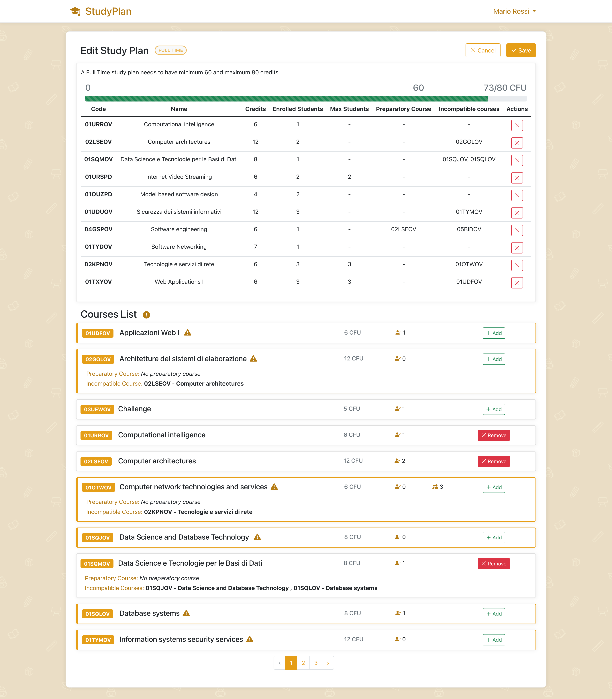

# Exam #1: StudyPlan
## Student: s299770 MORGIGNO MICHELE 

## React Client Application Routes

- Route `/`: Contains `HomepageRoute` with just the `CoursesList` if the user isn't logged in, otherwise it also shows the `StudyPlan` component from which you can view, create and edit the study plan.
- Route `/login`: Contains `LoginRoute` component if the user isn't already logged in, otherwise redirects to `/`. 

## API Server

- __GET__ `/api/courses/` - Get the list of all the courses
  - Response Status: `200` OK, `500` Internal Server Error
  - Response body: 
    ```
    [
      {
          "code": "01UDFOV",
          "name": "Applicazioni Web I ",
          "credits": 6,
          "enrolledStudents": 1,
          "maxStudents": null,
          "preparatoryCourse": [],
          "incompatibleCourses": [
              {
                  "code": "01TXYOV",
                  "name": "Web Applications I"
              }
          ]
      },
      {
          "code": "02GOLOV",
          "name": "Architetture dei sistemi di elaborazione",
          "credits": 12,
          "enrolledStudents": 0,
          "maxStudents": null,
          "preparatoryCourse": [],
          "incompatibleCourses": [
              {
                  "code": "02LSEOV",
                  "name": "Computer architectures "
              }
          ]
      }
      ...
    ```
  
- __GET__ `/api/study-plan/` - Get the study plan of the current user
  - Prerequisite: User is logged in
  - Request Body: __None__
  - Response Status: `200` OK, `401` Unauthorized, `500` Internal Server Error
  - Response Body: 
    ```
    StudyPlan {
    option: 0,
    credits: 22,
    studentId: 3,
    courses: [
      Course {
        code: '01URSPD',
        name: 'Internet Video Streaming',
        credits: 6,
        enrolledStudents: 2,
        maxStudents: 2,
        preparatoryCourse: [],
        incompatibleCourses: []
      },
      Course {
        code: '01OUZPD',
        name: 'Model based software design',
        credits: 4,
        enrolledStudents: 2,
        maxStudents: null,
        preparatoryCourse: [],
        incompatibleCourses: []
      },
      Course {
        code: '01UDUOV',
        name: 'Sicurezza dei sistemi informativi',
        credits: 12,
        enrolledStudents: 3,
        maxStudents: null,
        preparatoryCourse: [],
        incompatibleCourses: [Array]
      }
    ]
    } 
    ```
- __POST__ `/api/study-plan/` - Create a new study plan
  - Prerequisite: User is logged in
  - Request body: 
    ```
    {
      list: Course[] - List of courses to be inserted into the study plan
      option: number - Option of the study plan (Part Time, Full Time)
      credits: number - Total number of credits of the study plan
    }
    ```
  - Response Status: `201` Created, `401` Unauthorized, `422` Unprocessable entity (Bad body format), `503` Service Unavailable
  - Response Body: __None__

- __PUT__ `/api/study-plan/` - Edit a study plan
  - Prerequisite: User is logged in
  - Request body: 
    ```
    {
      list: Course[] - List of courses of the new study plan
      option: number - Option of the study plan (Part Time, Full Time)
      credits: number - Total number of credits of the updated study plan
    }
    ```
  - Response Status: `200` OK, `401` Unauthorized, `422` Unprocessable Entity, `503` Service Unavailable
  - Response Body: __None__

- __DELETE__ `/api/study-plan/` - Delete the study plan of the current user
  - Prerequisite: User is logged in
  - Request Body: __None__
  - Response Status: `204` No Content, `401` Unauthorized, `503` Service Unavailable

- __POST__ `/api/sessions` - Create a new session with the logged in user
  - Request Body:
    ```
    {
      username: 'mario.rossi@studenti.polito.it',
      password: password
    }
    ```
  - Response Status: `201` OK, `401` Unauthorized
  - Response Body: 
    ```
    {
      id: number - User ID
      email: string - User email
      name: string - User name
      surname: string - User surname
      option: number - Option of user's study plan
    }
    ```

- __GET__ `/api/sessions/current` - Get the info about the current user
  - Prerequisite: User is logged in
  - Request Body: __None__
  - Response Status: `200` OK, `401` Unauthorized
  - Response Body: 
    ```
    {
      id: number - User ID
      email: string - User email
      name: string - User name
      surname: string - User surname
      option: number - Option of user's study plan
    }
    ```

- __DELETE__ `/api/session/current` - Delete the current session and logout the user
  - Prerequisite: User is logged in
  - Request Body: __None__
  - Response Status: `204` No Content, `401` Unauthorized
  - Response Body: __None__

## Database Tables

- Table `course` - contains all the courses available.  
  *__Columns__:*
    - `code`: integer - Course Code (PK)
    - `name`: text - Course Name
    - `credits`: integer - Course Credits
    - `enrolledStudents`: integer - Course currently Enrolled Students
    - `maxStudents`: integer - Course Maximum Enrollable Students (optional)
    - `preparatoryCourse`: text - Course Preparatory Course Code (optional)  
  

- Table `incompatible_courses` - contains the incompatible courses of a certain course  
  *__Columns__:*
    - `courseCode`: text - Course Code (PK)
    - `incompatibleWith`: text - Course Code of the incompatible Course (PK)  
  

- Table `student` - contains the students (users)  
  *__Columns__:*
    - `id`: integer - Student ID
    - `email`: text - Student email
    - `name`: text - Student name
    - `surname`: text - Student surname
    - `hash`: text - Student password hashed
    - `salt`: text - Salt used to hash the password
    - `option`: integer - Option of the student study plan (optional)  
  

- Table `study_plan_courses` - contains the courses belonging to study plans  
  *__Columns__:*
    - `userId`: integer - Student ID (PK)
    - `courseCode`: text - Course Code (PK)

## Main React Components

- `StudyPlanViews` (in `StudyPlanViews.js`): contains the different views to show in the login route and the homepage route. Includes also a default route for the unrecognized routes.
- `NavBar` (in `NavBar.js`): navigation bar of the application, shows the logo, the login button when the user isn't logged in and the user name and surname and the logout button when the user is logged in.
- `UserActions` (in `AuthComponents.js`): has a NavDropdown to show user name and a logout button.
- `LoginForm` (in `AuthComponents.js`): login form with a custom validation function to validate email and password fields.
- `StudyPlan` (in `StudyPlan.js`): shows the study plan of the currently logged in user. Has several modes: 
  - __SHOW__, in which the `StudyPlanList` is shown, with a `Table` reporting the courses of the current user study plan, and `StudyPlanInfo` showing the option and the total credits of the current study plan; 
  - __PRECREATE__, which comes before __CREATE__ mode and is the phase in which the user chooses the option of the study plan;
  - __CREATE__ and __EDIT__ which show the `StudyPlanForm` in create or edit mode, by which you can choose the study plan option, add and remove courses from the current study plan. The `StudyPlanForm` also includes the component `StudyPlanList`, and shows a `ProgressBar` to display the current total number of credits of the study plan, clarifying which are the minimum and maximum credits constraints of the chosen option.
- `StudyPlanButtons.js`(in `StudyPlanButtons.js`): set of action buttons displayed in the `StudyPlan` component according to the current mode. Includes `CreateStudyPlanButton`, which opens the `StudyPlanForm` in PRECREATE mode, `EditStudyPlanBtn`, which opens the `StudyPlanForm` in EDIT mode, `DeleteStudyPlanBtn`, which opens a `Modal` to ask confirmation for the deleteion of the current study plan, `SaveStudyPlanBtn`, which calls the API to save permanently the current study plan and `CancelStudyPlanBtn`, which closes the `StudyPlanForm` and discards the unsaved changes to the current study plan.
- `CoursesList` (in `CoursesList.js`): component that shows all the courses that the university offers. Is a list of `CoursesListItem`, paginated in 10-elements pages. The component which handles pagination is `CoursesListPagination`. 
- `CoursesListItem` (in `CoursesList.js`): shows the single item of the courses list (code, name, credits, enrolledStudents, maxStudents). Has a state *warning* (updated through *checkCourseConstraints()*) which adds a different style to the component when the application is in __CREATE__/__EDIT__ mode and the course violates a costraint (preparatory course not added yet, incompatible course added to the study plan, maximum number of students reached), and a state *expanded* (updated through *toggleExpanded()*) which is set when the user clicks on the item, to expand it and show the description (incompatible courses, preparatory course).
- `Toast` (in `Toast.js`): is a customized component of the npm package *react-toastify* which displays an animated toast in the bottom-right corner of the screen. Has three props: 
  - *message*: the message to show
  - *type*: type of message that gives a different style to the toast (allowed values: *success, warning, error, info*)
  - duration: the duration of the toast (default 5000ms)

## Screenshot



## Users Credentials

- student@studenti.polito.it, password
- test@test.it, password
- dev@studenti.polito.it, password
- mario.rossi@polito.it, password
- michele.morgigno@studenti.polito.it, student
